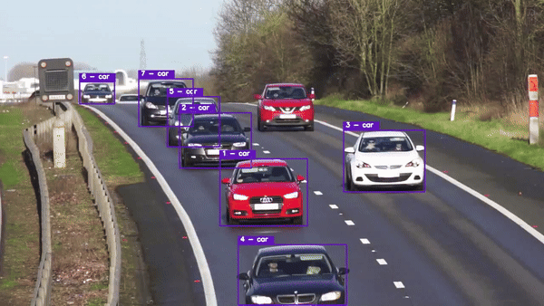

# YOLOv9_DeepSORT
This repository contains code for object detection and tracking in videos using the YOLOv9 object detection model and the DeepSORT algorithm.

## Demo 
<p align="center">
  
  
</p>

## Installation
1. Clone this repository:
  ```
   git clone https://github.com/sujanshresstha/YOLOv9_DeepSORT.git
   cd YOLO-NAS_DeepSORT
  ```

2. Create new environment using conda
  ```
  conda env create -f conda.yml
  conda activate yolonas-deepsort
  ```

3. Clone YOLOv9 repository:
  ```
   git clone https://github.com/WongKinYiu/yolov9.git
   pip install -r requirements.txt
  ```

## Usage
1. Prepare the video file:
   - Place the video file in the desired location.
   - Update the `video` flag in the path of the video file or set it to `0` to use the webcam as the input.
2. Download YOLOv9 model:
   - Clone the `model` from YOLOv9. 
   - Make sure the corresponding model weights are available.
3. Configure the output video:
   - Update `output` flag in the code to specify the path and filename of the output video file.
4. Set the confidence threshold:
   - Adjust the `conf` flag in the code to set the confidence threshold for object detection. Objects with confidence below this threshold will be filtered out.
5. If you want to detect and track certain object on video 
   - Modify the `class_id` flag in the code to specify the class ID for detection. The default value of the flag is set to None. If you wish to detect and track only persons, set it to 0, or refer to the coco.names file for other options.
6. If you want to blur certain object while tracking
   - Modify the `bulr_id` flag in the code to specify the class ID for detection. The default value of the flag is set to None. 

7. Run the code:
   ```
   # Run object tracking
   python object_tracking.py --video ./data/video/test.mp4 --output ./output/output.mp4 --model yolo_nas_l

   # Run object tracking on webcam (set video flag to 0)
   python object_tracking.py --video 0 --output ./output/webcam.mp4 --model yolo_nas_l

   # Run person tracking (set class_id flag to 0 for person)
   python object_tracking.py --video ./data/video/test.mp4 --output ./output/output.mp4 --model yolo_nas_l --class_id 0
   
   # Run tracking on a video with burring certain objects (set blur_id flag to 0 for person)
   python object_tracking.py --video ./data/video/test.mp4 --output ./output/output.mp4 --model yolo_nas_l --blur_id 0
   ```
   

## Acknowledgements
- This code is built upon the YOLOv9 model and the DeepSort algorithm.
- Credits to the authors and contributors of the respective repositories used in this project.

## References
- [Implementation of paper - YOLOv9: Learning What You Want to Learn Using Programmable Gradient Information](https://github.com/WongKinYiu/yolov9/blob/main/README.md)
- [Simple Online and Realtime Tracking with a Deep Association Metric](https://arxiv.org/abs/1703.07402)